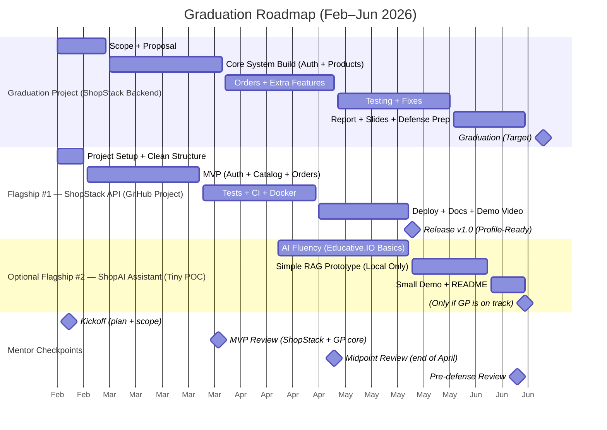

<h1 align="center">Hi, I'm Mahmoud Kharouf</h1>
<h3 align="center">Junior Backend Developer (Node.js • Express • PostgreSQL)</h3>

- Building REST APIs with authentication and clean structure
- Currently working on: YelpCamp
- Learning next: API testing (Jest/Supertest)

## Graduation Roadmap (Feb–Jun 2026)

### Summary of the Roadmap

- **Graduation Project**
  - Scope + proposal: Feb–Mar
  - Build core + features: Mar–Jun
  - Testing + report + defense: Jun–Aug

- **Flagship #1 – ShopStack API**
  - MVP: Feb–Mar
  - Hardening + tests: Mar–May
  - Deploy + docs: May–Jun

- **Flagship #2 – ShopAI Assistant**
  - AI fluency (Educative.IO): Apr–Jun
  - RAG + integration: Jul
  - Demo + case study: Jul–Aug

📄 Resume: https://github.com/KhMahmoud/KhMahmoud/blob/main/Mahmoud_Kharouf_Resume.pdf?raw=true  
🔗 LinkedIn: https://www.linkedin.com/in/mahmoud-kharouf-a9b952285/  
📫 Email: KharoufMahmoud@gmail.com
