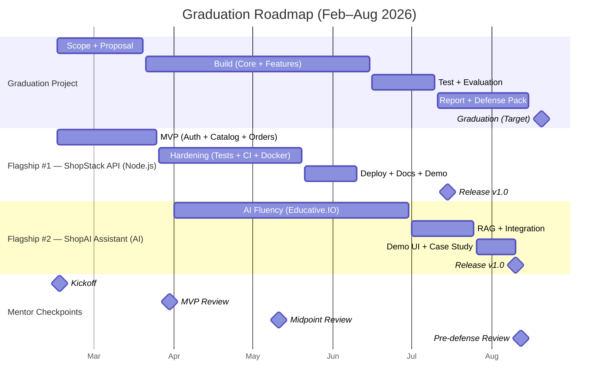

<h1 align="center">Hi, I'm Mahmoud Kharouf</h1>
<h3 align="center">Junior Backend Developer (Node.js • Express • PostgreSQL)</h3>

- Building REST APIs with authentication and clean structure
- Currently working on: YelpCamp
- Learning next: API testing (Jest/Supertest)

## Graduation Roadmap (Feb–Aug 2026)

📄 Resume: https://github.com/KhMahmoud/KhMahmoud/blob/main/Mahmoud_Kharouf_Resume.pdf?raw=true  
🔗 LinkedIn: https://www.linkedin.com/in/mahmoud-kharouf-a9b952285/  
📫 Email: KharoufMahmoud@gmail.com
